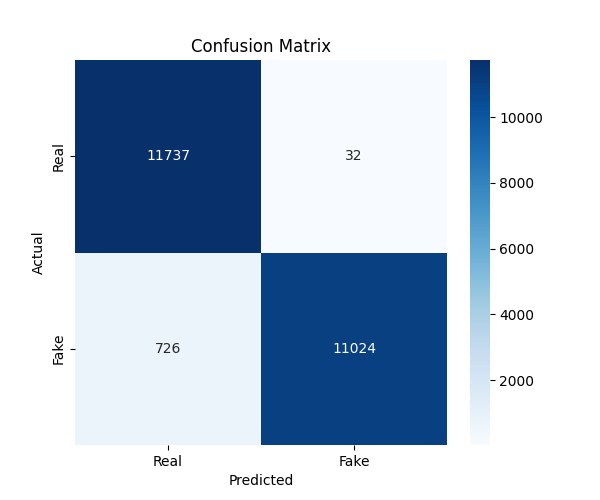
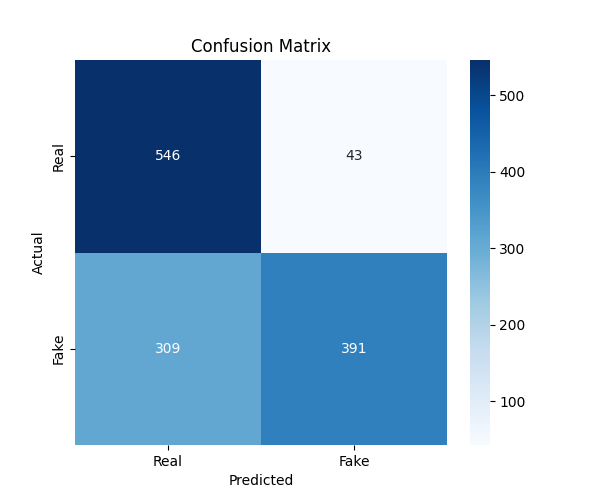
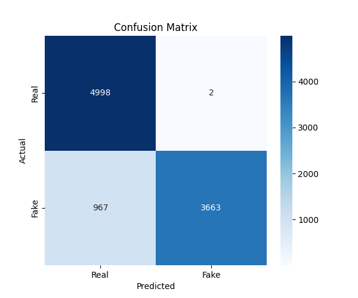
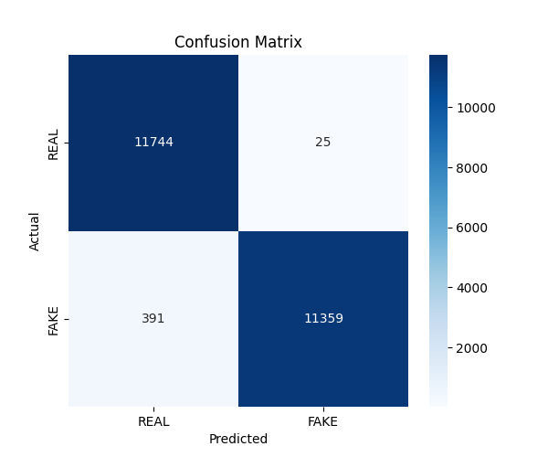
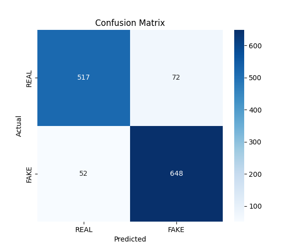
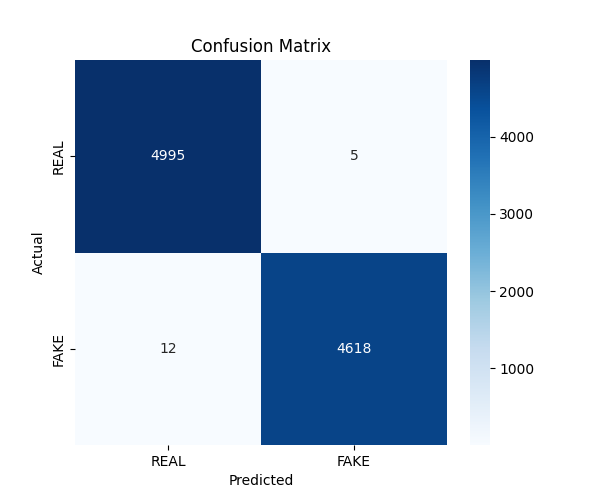
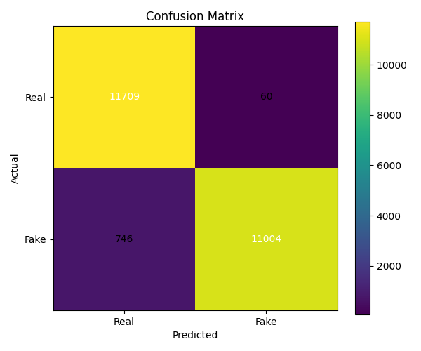
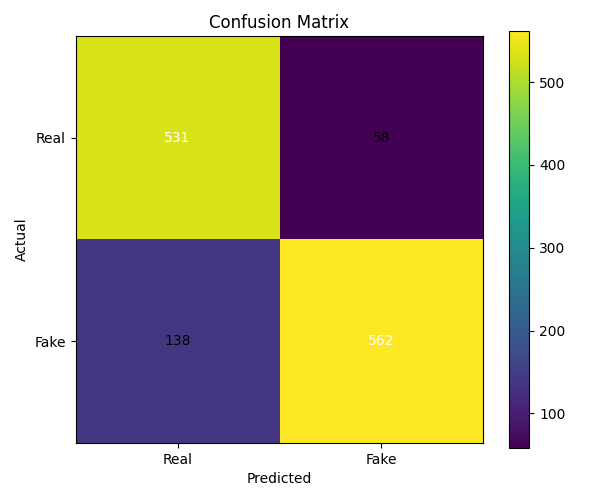
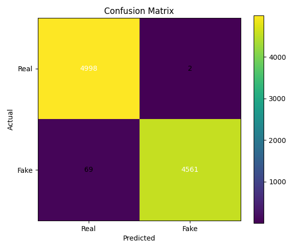

This project implements a **multi-architecture deepfake detection system** combining:

- Multimodal CNN (RGB + FFT + Noise)
- 9-Channel Vision Transformer (ViT)
- Single-Channel ViT (artifact-focused)

The system detects deepfakes by leveraging:

- Spatial inconsistencies (RGB)
- Frequency-domain artifacts (FFT)
- Forensic residual noise (SRM)
- Global attention mechanisms (Transformers)

---

### 🔹 1. Multimodal CNN
A **three-branch architecture**:

- RGB Branch (ConvNeXt-Tiny) → spatial features  
- FFT Branch (ResNet34) → frequency artifacts  
- Noise Branch (SRM + ResNet18) → manipulation residuals  

**Fusion:** Gated Fusion Module  
**Classifier:** Fully connected MLP  

```

INPUT IMAGE
│
├── RGB Branch ────────────────┐
├── FFT Branch ────────────────┼──► Gated Fusion ──► Classifier ──► Output
└── Noise Branch ──────────────┘

```

---

### 🔹 2. 9-Channel Vision Transformer (ViT)
#### Architecture

```

Input (9 Channels)
│
├── RGB (3 channels)
├── FFT (3 channels)
└── Noise / SRM (3 channels)
│
▼
Patch Embedding (16×16 patches)
│
▼
Linear Projection → Token Embeddings
│
▼
[CLS] Token + Positional Encoding
│
▼
Transformer Encoder Blocks (Multi-head Self Attention + MLP)
│
▼
Global Representation ([CLS] token)
│
▼
Fully Connected Head
│
▼
Binary Output (Real / Fake)

```

#### Key Idea

- Combines multiple modalities into a single transformer input  
- Learns cross-modal relationships globally  
- Strong at detecting subtle inconsistencies  

---

### 🔹 3. Single-Channel ViT
#### Architecture

```

Input (1 Channel)
│
├── Grayscale / FFT / Noise
│
▼
Patch Embedding
│
▼
Tokenization + Positional Encoding
│
▼
Transformer Encoder Layers
│
▼
[CLS] Token Representation
│
▼
Classification Head
│
▼
Binary Output

```

#### Key Idea

- Focuses purely on artifact-level signals  
- Removes RGB bias  
- Lightweight and efficient  

---

## Combined System View
```

INPUT IMAGE
│
├── RGB ───────────────► CNN Branch
├── FFT ───────────────► CNN Branch
├── Noise (SRM) ───────► CNN Branch
│                         │
│                         ▼
│                   Fusion Module
│                         │
│                         ▼
│                     Classifier
│
├──► 9-Channel ViT (RGB + FFT + Noise)
│
└──► Single-Channel ViT (artifact input)

```

---

## Project Structure
```

DeepFake-Detection/
│
├── CNN/
│   ├── dataset/
│   ├── models/
│   ├── training/
│   └── testing/
│
├── VIT/                      # 9-channel ViT
│   ├── dataset/
│   ├── models/
│   ├── training/
│   ├── testing/
│   └── utils/
│
├── VIT-SINGLE/              # Single-channel ViT
│   └── src/
│       ├── config.py
│       ├── data/
│       ├── models/
│       ├── training/
│       └── main.py
│
├── data/           (ignored in git hub)
│   ├── train/
│   ├── val/
│   └── test/
│
├── checkpoints/    (ignored in git hub)
│   ├── cnn/
│   ├── vit/
│   └── vit_single/
│
├── outputs/        (ignored in git hub)
│   ├── results_cnn/
│   ├── results_vit/
│   └── results_vit_single/
│
└── README.md

```

---

## Dataset Format
```

data/
├── train/
│   ├── real/
│   └── fake/
├── val/
│   ├── real/
│   └── fake/
├── test/
│   ├── real/
│   └── fake/

````

---

## Installation
```bash
git clone https://github.com/AdityaMMantri/DeepFake-Detection.git
cd DeepFake-Detection
pip install -r requirements.txt
````

---

### CNN
```bash
python -m CNN.training.train
```

### 9-Channel ViT
```bash
python -m VIT.training.train
```

### Single-Channel ViT
```bash
cd VIT-SINGLE
python src/main.py --mode train
```

---

### CNN
```bash
python -m CNN.testing.test
```

### ViT
```bash
python -m VIT.testing.test
```

### Single-Channel ViT
```bash
cd VIT-SINGLE
python src/main.py --mode test --checkpoint checkpoints/best_acc.pth
```

---

## Outputs
```
outputs/
├── results_cnn/
├── results_vit/
└── results_vit_single/
```

Includes:

* confusion_matrix.png
* predictions
* evaluation metrics

---

## Results

### Datasets Used for Evaluation

| Dataset | Description |
|---------|-------------|
| **Main (Training/Test Split)** | Primary dataset used for training and evaluation |
| **Dataset-5** | External test dataset for cross-dataset generalization |
| **Human Face Dataset** | Separate human face–specific test dataset |

---

### 🔹 1. Multimodal CNN Results

#### Main Dataset (Training/Test Split)

| Metric | Value |
|--------|-------|
| **Accuracy** | 96.78% |
| **Precision** | 99.71% |
| **Recall** | 93.82% |
| **F1 Score** | 96.68% |

**Confusion Matrix:**

|  | Predicted Real | Predicted Fake |
|--|:-:|:-:|
| **Actual Real** | 11,737 | 32 |
| **Actual Fake** | 726 | 11,024 |

<p align="center">
  
</p>

#### Test on Dataset-5 (Cross-Dataset)

| Metric | Value |
|--------|-------|
| **Accuracy** | 72.69% |
| **Precision** | 90.09% |
| **Recall** | 55.86% |
| **F1 Score** | 68.96% |

**Confusion Matrix:**

|  | Predicted Real | Predicted Fake |
|--|:-:|:-:|
| **Actual Real** | 546 | 43 |
| **Actual Fake** | 309 | 391 |

<p align="center">
  
</p>

#### Test on Human Face Dataset

| Metric | Value |
|--------|-------|
| **Accuracy** | 89.94% |
| **Precision** | 99.95% |
| **Recall** | 79.11% |
| **F1 Score** | 88.32% |

**Confusion Matrix:**

|  | Predicted Real | Predicted Fake |
|--|:-:|:-:|
| **Actual Real** | 4,998 | 2 |
| **Actual Fake** | 967 | 3,663 |

<p align="center">
  
</p>

---

### 🔹 2. Single-Channel ViT Results

#### Main Dataset (Training/Test Split)

| Metric | Value |
|--------|-------|
| **Accuracy** | 98.23% |
| **AUC** | 0.9978 |
| **Precision** | 99.78% |
| **Recall** | 96.67% |
| **F1 Score** | 98.20% |

**Confusion Matrix:**

|  | Predicted Real | Predicted Fake |
|--|:-:|:-:|
| **Actual Real** | 11,744 | 25 |
| **Actual Fake** | 391 | 11,359 |

<p align="center">
  
</p>

#### Test on Dataset-5 (Cross-Dataset)

| Metric | Value |
|--------|-------|
| **Accuracy** | 90.38% |
| **AUC** | 0.9542 |
| **Precision** | 90.00% |
| **Recall** | 92.57% |
| **F1 Score** | 91.27% |

**Confusion Matrix:**

|  | Predicted Real | Predicted Fake |
|--|:-:|:-:|
| **Actual Real** | 517 | 72 |
| **Actual Fake** | 52 | 648 |

<p align="center">
  
</p>

#### Test on Human Face Dataset

| Metric | Value |
|--------|-------|
| **Accuracy** | 99.82% |
| **AUC** | 1.0000 |
| **Precision** | 99.89% |
| **Recall** | 99.74% |
| **F1 Score** | 99.82% |

**Confusion Matrix:**

|  | Predicted Real | Predicted Fake |
|--|:-:|:-:|
| **Actual Real** | 4,995 | 5 |
| **Actual Fake** | 12 | 4,618 |

<p align="center">
  
</p>

---

### 🔹 3. 9-Channel ViT Results

#### Main Dataset (Training/Test Split)

| Metric | Value |
|--------|-------|
| **Accuracy** | 96.57% |
| **Precision** | 99.46% |
| **Recall** | 93.65% |
| **F1 Score** | 96.47% |
| **AUC-ROC** | 98.19% |

**Confusion Matrix:**

|  | Predicted Real | Predicted Fake |
|--|:-:|:-:|
| **Actual Real** | 11,709 | 60 |
| **Actual Fake** | 746 | 11,004 |

<p align="center">
  
</p>

#### Test on Dataset-5 (Cross-Dataset)

| Metric | Value |
|--------|-------|
| **Accuracy** | 84.79% |
| **Precision** | 90.65% |
| **Recall** | 80.29% |
| **F1 Score** | 85.15% |

**Confusion Matrix:**

|  | Predicted Real | Predicted Fake |
|--|:-:|:-:|
| **Actual Real** | 531 | 58 |
| **Actual Fake** | 138 | 562 |

<p align="center">
  
</p>

#### Test on Human Face Dataset

| Metric | Value |
|--------|-------|
| **Accuracy** | 99.26% |
| **Precision** | 99.96% |
| **Recall** | 98.51% |
| **F1 Score** | 99.23% |

**Confusion Matrix:**

|  | Predicted Real | Predicted Fake |
|--|:-:|:-:|
| **Actual Real** | 4,998 | 2 |
| **Actual Fake** | 69 | 4,561 |

<p align="center">
  
</p>

---

### 📈 Summary — Model Comparison

#### Main Dataset (Training/Test Split)

| Model | Accuracy | Precision | Recall | F1 Score |
|-------|:--------:|:---------:|:------:|:--------:|
| Multimodal CNN | 96.78% | 99.71% | 93.82% | 96.68% |
| Single-Channel ViT | **98.23%** | **99.78%** | **96.67%** | **98.20%** |
| 9-Channel ViT | 96.57% | 99.46% | 93.65% | 96.47% |

#### Cross-Dataset Generalization (Dataset-5)

| Model | Accuracy | Precision | Recall | F1 Score |
|-------|:--------:|:---------:|:------:|:--------:|
| Multimodal CNN | 72.69% | 90.09% | 55.86% | 68.96% |
| Single-Channel ViT | **90.38%** | 90.00% | **92.57%** | **91.27%** |
| 9-Channel ViT | 84.79% | **90.65%** | 80.29% | 85.15% |

#### Human Face Dataset

| Model | Accuracy | Precision | Recall | F1 Score |
|-------|:--------:|:---------:|:------:|:--------:|
| Multimodal CNN | 89.94% | 99.95% | 79.11% | 88.32% |
| Single-Channel ViT | **99.82%** | 99.89% | **99.74%** | **99.82%** |
| 9-Channel ViT | 99.26% | **99.96%** | 98.51% | 99.23% |

> **Key Takeaway:** The **Single-Channel ViT** consistently achieves the best overall performance across all datasets, with particularly strong cross-dataset generalization (90.38% on Dataset-5). The **9-Channel ViT** provides strong results on in-domain data while the **Multimodal CNN** shows the highest precision on specific datasets but lower recall.

---

## Pretrained Models
[https://huggingface.co/Aditya11031/deepfake-detector-models](https://huggingface.co/Aditya11031/deepfake-detector-models)

```
checkpoints/
├── cnn/best_model.pth
├── vit/best_model.pth
└── vit_single/best_model.pth
```

---

## Key Features
* Multimodal learning (RGB + FFT + Noise)
* Transformer-based global reasoning
* Artifact-focused detection
* Modular pipeline
* Scalable architecture

---

## Limitations
* Sensitive to dataset quality
* Fixed threshold (0.5)
* No video modeling
* Limited cross-dataset validation

---

## Future Work
* CNN + ViT ensemble
* Video deepfake detection
* Threshold optimization
* Deployment (API / web app)
* Real-time inference

---

## Author
Aditya Mantri\
Abeer Chourey\
Janvi Jain\
BTech AI & Data Science
